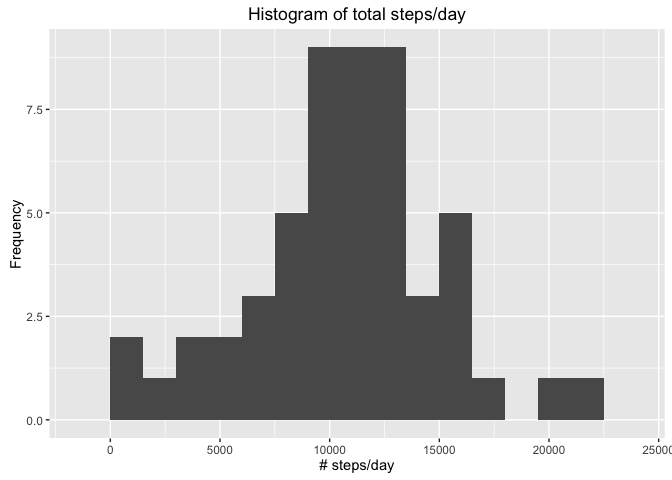
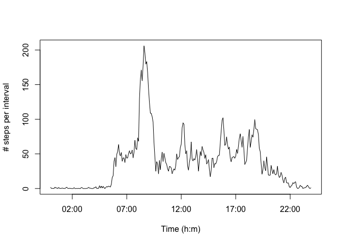
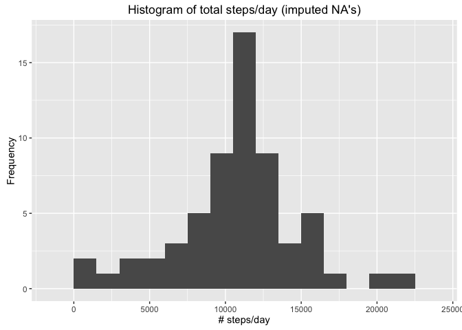
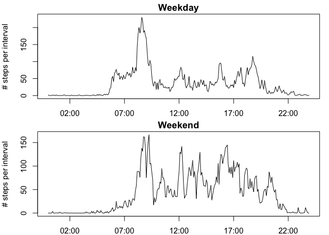

# Reproducible Research: Peer Assessment 1

Introduction

It is now possible to collect a large amount of data about personal movement using activity monitoring devices such as a Fitbit, Nike Fuelband, or Jawbone Up. These type of devices are part of the ???quantified self??? movement ??? a group of enthusiasts who take measurements about themselves regularly to improve their health, to find patterns in their behavior, or because they are tech geeks. But these data remain under-utilized both because the raw data are hard to obtain and there is a lack of statistical methods and software for processing and interpreting the data.

This assignment makes use of data from a personal activity monitoring device. This device collects data at 5 minute intervals through out the day. The data consists of two months of data from an anonymous individual collected during the months of October and November, 2012 and include the number of steps taken in 5 minute intervals each day.

The data for this assignment can be downloaded from the course web site:

Dataset: [Activity monitoring data] (https://d396qusza40orc.cloudfront.net/repdata%2Fdata%2Factivity.zip)
The variables included in this dataset are:

steps: Number of steps taking in a 5-minute interval (missing values are coded as ????????)
date: The date on which the measurement was taken in YYYY-MM-DD format
interval: Identifier for the 5-minute interval in which measurement was taken
The dataset is stored in a comma-separated-value (CSV) file and there are a total of 17,568 observations in this dataset.

## Loading and preprocessing the data


```r
download.file("https://d396qusza40orc.cloudfront.net/repdata%2Fdata%2Factivity.zip", destfile="activity.zip")
unzip("activity.zip")
actdata <- read.csv("./activity.csv")
start <- as.POSIXct(x = "0:00", format = "%H:%M")
time <- seq(from = start, by = "5 mins", length.out = 288)
```

## What is mean total number of steps taken per day?


```r
library(ggplot2)
daystepstotal <- aggregate(actdata$steps, list(actdata$date), sum)
daystepstotal$Group.1 <- as.Date(daystepstotal$Group.1, "%Y-%m-%d")
ggplot(daystepstotal,
       aes(x=x)) +
       geom_histogram(binwidth=1500,
                      position='identity') +
       ylab("Frequency") + xlab("# steps/day") +
  ggtitle("Histogram of total steps/day")
```

```
## Warning: Removed 8 rows containing non-finite values (stat_bin).
```

\

```r
meansteps <- mean(daystepstotal$x,
                  na.rm = TRUE)
mediansteps <- median(daystepstotal$x,
                      na.rm = TRUE)
```


## What is the average daily activity pattern?


```r
daystepsmean <- aggregate(actdata$steps,
                          list(actdata$interval),
                          mean, na.rm = T)
plot(y = daystepsmean$x,
     x = time,
     type = "l",
     xlab = "Time ",
     ylab = "# steps per interval")
```

\

```r
mostactive <- subset(daystepsmean,
                     x == max(daystepsmean$x))
```

## Imputing missing values


```r
NAs <- sum(is.na(actdata$steps))
actdata_impute <- actdata
actdata_impute$steps[is.na(actdata_impute$steps)] <-   as.integer(daystepsmean$x)
daystepstotal_impute <- aggregate(actdata_impute$steps,
                                  list(actdata_impute$date), sum)
daystepstotal_impute$Group.1 <- as.Date(daystepstotal_impute$Group.1,
                                        "%Y-%m-%d")
ggplot(daystepstotal_impute,
       aes(x=x)) +
       geom_histogram(binwidth=1500, position='identity') +
       ylab("Frequency") + xlab("# steps/day") +
       ggtitle("Histogram of total steps/day (imputed NA's)")
```

\

```r
meansteps_impute <- mean(daystepstotal_impute$x, na.rm = TRUE)
mediansteps_impute <- median(as.integer(daystepstotal_impute$x), na.rm = TRUE)
```

## Are there differences in activity patterns between weekdays and weekends?


```r
actdata_impute$date1 <- weekdays(as.Date(actdata_impute$date))
actdata_impute_weekend <- subset(actdata_impute,
                                 date1 == "Saturday" | date1 == "Sunday")
weekendstepsmean <- aggregate(actdata_impute_weekend$steps,
                              list(actdata_impute_weekend$interval),
                              mean, 
                              na.rm = T)
actdata_impute_weekday <- subset(actdata_impute, 
                                 date1 == "Monday" | date1 == "Tuesday" |    date1 == "Wednesday" | date1 == "Thursday" | date1 == "Friday")
weekdaystepsmean <- aggregate(actdata_impute_weekday$steps,
                              list(actdata_impute_weekday$interval), 
                              mean, na.rm = T)

actdata_impute_weekday$date1 <- "weekday"
actdata_impute_weekend$date1 <- "weekend"
actdata_impute_necessary <- rbind(actdata_impute_weekday,
                                  actdata_impute_weekend)

start <- as.POSIXct(x = "0:00", format = "%H:%M")
time <- seq(from = start, by = "5 mins", length.out = 288)

plot <- par(mfrow=c(2,1), mar = c(2,4,1.5,1))
plot(y = weekdaystepsmean$x,
     x = time, 
     type = "l",
     ylab = "# steps per interval",
     main  = "Weekday")
plot(y = weekendstepsmean$x,
     x = time,
     type = "l",
     ylab = "# steps per interval",
     main = "Weekend")
```

\

